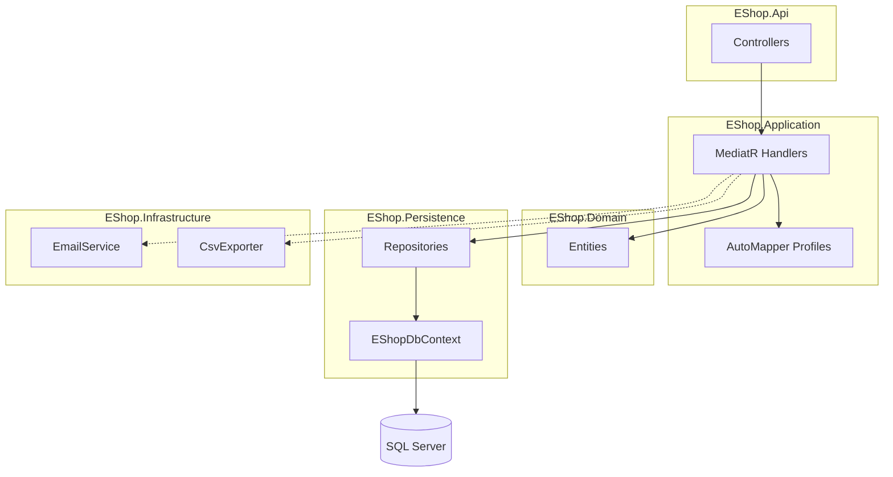

# Software Design Documentation

*Generated from repository analysis. No Jira source.*

### 1. Header

```
# Software Design Documentation
**EShop Clean Architecture API**

---

Version 1.0
```

### 2. Sign-off Table

| Name | Role/Designation | Signoff Date | Signature |
|------|-----------------|--------------|-----------|
|      | Product Manager  |              |           |
|      | Solution Architect |            |           |
|      | Lead Developer   |              |           |
|      | Application Architect |          |           |

### 3. Records of Changes

| Version | Date       | Author | Description of Change |
|---------|------------|--------|------------------------|
| 1.0     | 2026-04-16 |        | Initial version (derived from codebase) |

### 4. Overview

The **EShop** solution is an ASP.NET Core reference implementation organized as **Clean Architecture**: a web API (`EShop.Api`) orchestrates HTTP requests, the **Application** layer implements use cases with MediatR and AutoMapper, **Domain** holds entities and contracts, **Persistence** provides Entity Framework Core and SQL Server storage, and **Infrastructure** hosts cross-cutting integrations such as email and CSV export.

The current codebase exposes a read API for product **categories** and persists a broader catalog and **order** model (categories, products, orders, order lines, order types). Application handlers exist for listing categories and for creating categories via commands, but only the list operation is wired to an HTTP controller at present.

**Objectives**

- Demonstrate separation of concerns across API, application, domain, persistence, and infrastructure layers.
- Support CRUD-style workflows through MediatR commands/queries and repository abstractions.
- Persist relational data in Microsoft SQL Server with auditable entities and EF Core configurations.
- Provide extension points for email notifications and file export without coupling domain logic to concrete providers.

**Build vs Buy**

- **Build:** Core API, domain model, and persistence (team-owned).
- **Buy / platform:** ASP.NET Core, EF Core, MediatR, AutoMapper, FluentValidation (packages); SQL Server as the database engine.

### 5. Context

### Business Context

`<TBD — needs input from Product Manager>` — Business drivers, target users, and commercial scope for this e-shop instance are not defined in the repository.

### Technical Context

The system is a **.NET 10** web application (`EShop.Api`) referencing `EShop.Application`, `EShop.Infrastructure`, and `EShop.Persistence`. The API registers application services (AutoMapper, MediatR), infrastructure (email, CSV export), and persistence (DbContext, repositories). Controllers inherit a shared base route `api/[controller]` and use **MediatR** to dispatch queries/commands. Data access uses **EF Core** with SQL Server and generic `IAsyncRepository<>` implementations scoped per request.

### Operational Context

The API runs as a standard Kestrel-hosted ASP.NET Core process. Configuration uses `appsettings.json` / `appsettings.Development.json` for connection strings, logging, allowed hosts, and optional email settings. Database schema is managed via EF Core migrations (tools package present on the API project). `<TBD — needs input from Operations>` — Deployment topology, secrets management, and backup strategy are not specified in-repo.

### Integration Points

- **Microsoft SQL Server** — Primary transactional store for categories, products, orders, and related entities.
- **SMTP / transactional email provider** (via `IEmailService` / `EmailService`) — Optional outbound mail; `EmailSettings` section exists but binding is commented out in infrastructure registration.
- **File system / download consumers** (via `ICsvExporter` / `CsvExporter`) — CSV export capability for downstream use when invoked from application code.

### 6. User and Functional Requirements (if applicable)

| ID | User Story | Functional Requirement |
|----|-----------|------------------------|
| RQ1 | As a client application I want to retrieve all product categories so that I can display or filter catalog navigation | 1. `GET api/Category` returns HTTP 200 with a JSON array of categories (`Id`, `Name`) sorted by name. |
| RQ2 | `<TBD>` | Create-category command handlers exist (`CreateCategoryCommand`) but no public API route was found; expose and document when in scope. |

### 7. High Level Design

**Architecture (logical)**



**Key Components**

- **EShop.Api** — HTTP surface, CORS, HTTPS redirection, controller routing.
- **EShop.Application** — MediatR requests/handlers, view models, AutoMapper profiles, validation and feature folders.
- **EShop.Domain** — Entities (`Category`, `Product`, `Order`, `OrderDetails`, `OrderType`) and shared base types (`AuditableEntity`, `IEntity<T>`).
- **EShop.Persistence** — `EShopDbContext`, EF configurations, concrete repositories implementing application contracts.
- **EShop.Infrastructure** — Concrete implementations of cross-cutting services (email, CSV).

**Workflow Summary (happy path — list categories)**

1. Client calls `GET /api/Category`.
2. `CategoryController` builds `GetCategoryListQuery` and sends it via `IMediator`.
3. `GetCategoryListQueryHandler` loads all categories through `IAsyncRepository<Category>`, orders by name, maps to `CategoryListVm`, returns JSON.

**Entity Relationships**

- `Category` 1—* `Product` (shadow FK `CategoryId` on `Product`).
- `Order` *—1 `OrderType` (required FK `OrderTypeId`).
- `OrderDetails` *—1 `Order` (cascade delete), *—1 `Product` (restrict delete).

### 8. Pre-Requisites

### Hardware and Software Requirements

- Runtime: **.NET 10** SDK for build and run.
- Database: **Microsoft SQL Server** reachable from the API host using the configured connection string.
- `<TBD — needs input from Infrastructure>` — CPU/memory sizing and HA topology.

### Third-Party Dependencies

- NuGet: MediatR, AutoMapper, FluentValidation, Microsoft.EntityFrameworkCore (via projects), EF Core SQL Server provider, EF Core Tools (API project).

### Security Requirements

- HTTPS redirection enabled in the pipeline.
- CORS policy **"open"** allows configured `ApiUrl` / `WebUrl` origins from configuration; `SetIsOriginAllowed(_ => true)` effectively permits any origin — **review before production** (`StartupExtensions`).
- `<TBD — needs input from Security>` — Authentication, authorization, API keys, and rate limiting are not implemented on controllers observed in the codebase.

### Data Requirements

- Connection string key: `ConnectionStrings:DefaultConnection` (see `appsettings.json`).
- Optional: `EmailSettings` for outbound mail when enabled.

### 9. Assumptions

| # | Assumption | Summary |
|---|-----------|---------|
| 1 | SQL Server is the sole system of record for catalog and orders | If wrong, persistence layer must be replaced or augmented; verify with infrastructure and data governance. |
| 2 | MediatR handlers in the Application assembly are discovered at runtime | If wrong, commands may not register; verify startup and integration tests. |
| 3 | Internal/trusted callers only until auth is added | If exposed publicly without hardening, abuse risk increases; verify security review. |

### 10. Technical Approach

### Feature Description

The service implements a **vertical slice** for **categories** (query list + command create in application layer) and a **relational persistence model** for orders and products ready for future API expansion.

### Design Approach

- **Pipeline:** Minimal middleware — CORS, HTTPS redirection, endpoint routing to controllers.
- **Data flow:** Controller → MediatR → repository → DbContext → SQL Server; audit timestamps set in `SaveChangesAsync` for `AuditableEntity` subclasses.
- **Trade-offs:** Open CORS and lack of auth simplify local development but are unsuitable for production without additional controls.

### Component Breakdown

- **CategoryController** — Dispatches category queries to MediatR.
- **GetCategoryListQueryHandler** — Reads all categories, maps to `CategoryListVm`.
- **CreateCategoryCommandHandler** — Creates category entities via repository (no HTTP entrypoint in current tree).
- **EShopDbContext** — Unit of work; applies configurations from assembly; maintains audit fields.
- **BaseRepository / feature repositories** — Data access behind `IAsyncRepository<>` and specific repository interfaces.

### Key Behaviors

| Step | Description |
|------|-------------|
| 1 | HTTP request hits ASP.NET Core routing and controller action. |
| 2 | MediatR resolves the handler from DI; handler uses repositories and mapper. |
| 3 | EF Core tracks entities; on `SaveChangesAsync`, `CreatedDate` / `LastModifiedDate` are stamped for auditable rows. |

### Resilience and Fallbacks

`<TBD — needs input from Engineering>` — Retry policies, circuit breakers, and idempotency for external email/export are not defined in the current code.

### Configuration Management

JSON configuration via standard ASP.NET Core host; connection strings and URLs should be overridden per environment (environment variables, secret store). `<TBD — needs input from DevOps>` — Central config service or Key Vault integration.

### Extensibility

- New endpoints: add controllers or actions, register new MediatR requests/handlers under `Application/Features`.
- New persistence: implement repository interfaces and EF configurations; register in `PersistenceServiceRegistration`.
- New integrations: implement application contracts in Infrastructure and register in `InfrastructureServiceRegistration`.

### 11. API Details

### GET /api/Category
**Description:** Returns all product categories ordered by name.

**Request:** None (query body empty).

**Response (200 OK):** JSON array of objects:
```json
[
  { "id": "<guid>", "name": "string" }
]
```

**Auth requirements:** `<TBD — not implemented in codebase>`

**Rate limiting:** `<TBD>`

**Error codes:** Standard ASP.NET Core problem details / framework defaults for unhandled exceptions; `<TBD>` — explicit problem contract not defined.

---

### POST /api/Category (or equivalent)
**Description:** `<TBD — CreateCategoryCommand exists but no controller action was found; specify route, request DTO, and status codes when implemented.>`

### 12. Storage / Data Model

### Database Type

- **Microsoft SQL Server** (via EF Core).

### Schema / Tables

Logical tables correspond to EF sets: `Categories`, `Products`, `Orders`, `OrderTypes`, `OrderDetails`. Representative columns (from domain and configurations):

| Table / Entity | Key columns | Notes |
|----------------|-------------|--------|
| Categories | `Id` (PK, Guid), `Name` (required, max 50), audit columns | From `Category` + `CategoryConfiguration` |
| Products | `Id` (PK, Guid), `CategoryId` (FK, shadow), audit columns | `Product` entity; navigation from `Category` |
| Orders | `Id`, `UserId`, `OrderTypeId`, `OrderTotal`, `OrderPlaced`, `OrderPaid`, audit columns | FK to `OrderTypes` |
| OrderTypes | `Id`, `Type` | |
| OrderDetails | `Id`, `OrderId`, `ProductId` | Cascade with `Order`, restrict delete on `Product` |

**Indexes:** `<TBD — add explicit index strategy for production query patterns>`

### Cache Model (if applicable)

`<TBD>` — No distributed or in-memory cache abstraction is present in the reviewed code.

### Sync Strategy

`<TBD>` — N/A unless caching or read replicas are introduced.

### 13. Non-Functional Requirements

### Performance

`<TBD — needs benchmarks>` — List-all categories loads entire table; pagination should be defined for large catalogs.

### Scalability

Stateless API tier can scale horizontally if session affinity is not required; database becomes the primary bottleneck. `<TBD>` — Read scaling and sharding strategy.

### Security

TLS in transit (HTTPS redirection). **CORS** is permissive; **no authentication/authorization** on observed endpoints. Audit fields exist but population of `CreatedBy` / `LastModifiedBy` is `<TBD>` — not set in the reviewed `SaveChangesAsync` override.

### Multitenancy (if applicable)

`<TBD>` — Single-tenant model implied; no tenant key on entities.

### Maintainability

Clear layer boundaries and feature folders support evolution; MediatR registration uses `AppDomain.CurrentDomain.GetAssemblies()` — ensure performance and assembly discovery remain acceptable as the solution grows.

### 14. External System Dependencies

| System | Purpose | Integration Type |
|--------|---------|------------------|
| Microsoft SQL Server | Primary data store | ADO.NET / EF Core |
| Email provider (SMTP/API) | Optional notifications | Application contract + Infrastructure implementation |
| Local / downstream file consumers | CSV export | Application contract + Infrastructure implementation |

### 15. Deployment & Infrastructure

`<TBD — needs input from DevOps>` — Target hosting (IIS, K8s, Azure App Service, containers), blue-green vs rolling strategy, and environment matrix.

**CI/CD pipeline stages:** `<TBD>` — Not defined in this document scope.

**Environment-specific configuration:** Use distinct connection strings and CORS origins per environment; restrict open CORS before production.

### 16. Troubleshooting

### Runbooks

`<TBD — link operational runbooks>`

### Common Issues

- **Database connection failures** — Verify `DefaultConnection`, SQL Server availability, and TLS/firewall rules.
- **Empty or unexpected CORS behavior** — Check `ApiUrl`, `WebUrl`, and the `SetIsOriginAllowed` policy in `StartupExtensions`.

### Error Handling

Unhandled exceptions propagate through ASP.NET Core default middleware; `<TBD>` — Centralized exception handling and structured logging conventions.

### Root Cause Analysis

1. Reproduce with API logs and HTTP trace.  
2. Verify EF Core migrations applied and schema matches entities.  
3. Inspect MediatR handler and repository for the failing use case.

### Rollback Mechanism

`<TBD — needs release process>` — Revert deployment artifact and, if needed, roll back database migrations per team procedure.
